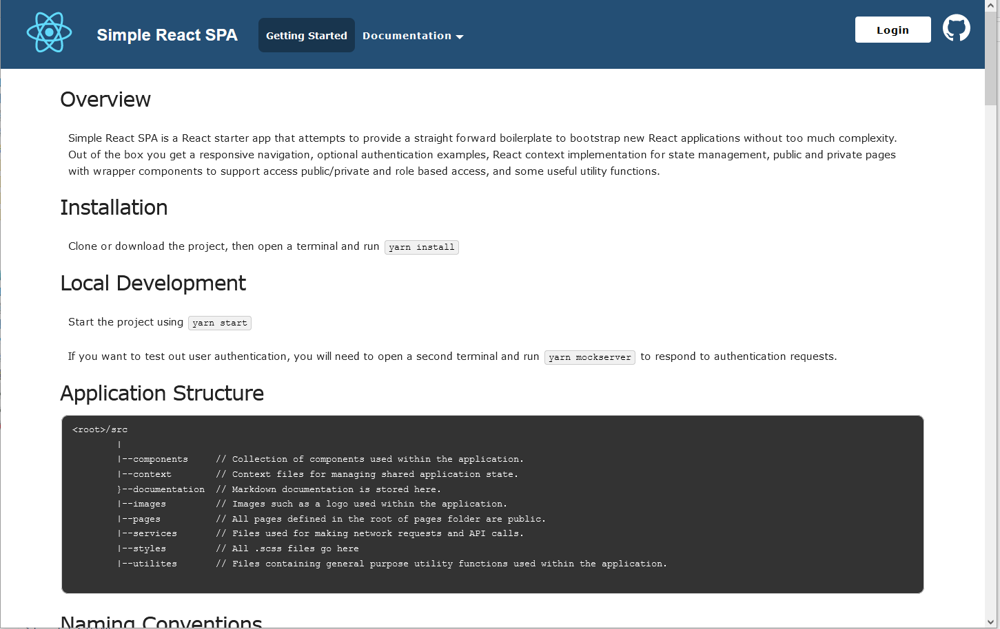

# Overview

Simple React SPA is a React starter app that attempts to provide a straight forward boilerplate to bootstrap new React applications without too much complexity. Out of the box you get a responsive navigation, optional authentication examples, React context implementation for state management, public and private pages with wrapper components to support access public/private and role based access, and some useful utility functions.



# Installation

Clone or download the project, then open a terminal and run `yarn install`

# Local Development

Start the project using `yarn start`

If you want to test out user authentication, you will need to open a second terminal and run `yarn mockserver` to respond to authentication requests.

# Application Structure

```
<root>/src
        |
        |--components     // Collection of components used within the application.
        |--context        // Context files for managing shared application state.
        }--documentation  // Markdown documentation is stored here.
        |--images         // Images such as a logo used within the application.
        |--pages          // All pages defined in the root of pages folder are public.
        |--services       // Files used for making network requests and API calls.
        |--styles         // All .scss files go here
        |--utilites       // Files containing general purpose utility functions used within the application.

```

# Naming Conventions

All files that a export a React component are named using the same case sensitive filename as the component. When more than one component is exported from a file, the filename will match the `default` export component name. Following this convention allows for dynamic imports of page components. See [Dynamic Imports](#dynamic-imports) below.

Function names are all camel-cased.

# Application Configuration

The application configuration can be found under `/src/config.js`

```
const AUTHENTICATION_SERVER = "http://localhost:3456"; // Mockserver address. Start the mockserver using `yarn mockserver`.
const APP_API_SERVER = "/"; // API server for app data requests.

/**
 * Set the source of the logo.
 * If you do not want a logo to display, either set logoSrc to null,
 * or open /src/components/NavBar.js and remove the logoSrc prop that is passed to the PushyNavBar component.
 */
const logoSrc = require("./images/react-icon.svg").default;

const config = {
  debugMode: true, // When true, logs to the console the context or state values for functions wrapped with connectLogger().
  authenticationType: "example", // Values: "none" will remove the login button and not implement authentication.  "example" will demonstrate a mock authentication.
  useRoles: true, // When true, will request user roles from the roleseService upon successful login.
  siteMetadata: {
    logoSrc: logoSrc,
    title: "Simple React SPA", // Title that appears in the navigation bar.
    description:
      "Provides a simple Single Page Application to quickly build a React application"
  },
  server: {
    siteRoot: "/" // Used by the NavBar, page configurations, authentication functions, etc. to redirect users to the app root (home page).
  },
  services: {
    loginService: `${AUTHENTICATION_SERVER}/login`, // URL to send login request for user authentication.
    rolesService: `${AUTHENTICATION_SERVER}/userroles`,
    tokenValidationService: `${AUTHENTICATION_SERVER}/validate`, // URL of endpoint to validate authentication tokens.
    appAPI: `${APP_API_SERVER}` // API server URL for application API's.
  },
  userStorageKey: "simpleReactSPAUser" // String name of the user object stored in the session storage.
};

export default config;

```

# Pages

To add pages to the application, open up `/src/pages/pages.config.js` and add a new page object to the `pages` array. Each page must consist of at least two properties `to` and `component`, all other properties are optional.

## Page Object properties

The `pages.config.js` file is where you define all your application routes and primary navigation items. The out-of the box menu supports a two-level navigation with top level navigation items and a single sub-menu as a drop-down.

| Property    | Type    | Required/Optional | Description                                                                                                                                                                                                                                                                                                                                                      |
| ----------- | ------- | ----------------- | ---------------------------------------------------------------------------------------------------------------------------------------------------------------------------------------------------------------------------------------------------------------------------------------------------------------------------------------------------------------- |
| `to`        | String  | Optional          | URL path of the route used by React Router. Example: `"/route-to-page"`                                                                                                                                                                                                                                                                                          |
| `component` | String  | Optional          | Name of the component to load and execute.                                                                                                                                                                                                                                                                                                                       |
| `menu`      | Boolean | Optional          | When `true` the menu item will appear in the menu.                                                                                                                                                                                                                                                                                                               |
| `text`      | String  | Optional          | Text to display for the navigation item.                                                                                                                                                                                                                                                                                                                         |
| `children`  | Array   | Optional          | Array of children page objects to appear as sub-navigation items.                                                                                                                                                                                                                                                                                                |
| `source`    | String  | Optional          | If the component to render is not located within, the `/src/pages/` folder, you can optionally specify a new path to the component. The path is relative to the `/src/` folder without the preceding slash. For example to load a component from the `/src/components/` folder, you would specify the `source` property as `"components/ReactComponentFileName"` |
| `props`     | Object  | Optional          | Object of props that will be passed to a page component. **Recommendation:** Only define simple props within the `page.config.js` file, for example passing a `title` prop to page as a title or header. Keep the `pages.config.js` file clean and place complex props in the page component files.                                                              |

## Types of Pages

There are two types of configurations that are supported when defining a page configuration

1. Page that displays a component when a route is matched by React Router.
2. Page that acts as a parent navigation item containing a list of "children" pages.

Pages that display components must define a least the `to` and `component` properties. When the route defined by the `to` property is matched, the page will display the React component named in the `component` property. All other properties are optional. For example, if you want the page to appear in the navigation, make sure to define `menu: true` and `text: "Menu Item Text` properties.

Page confiturations that have children, should have the `menu: true` so the item will appear in the menu, the `text` property to apply the menu item text, and the `children` property as an array of child pages to display as a drop-down menu. All other properties are optional for this type of configuration.

## Dynamic Imports

If you follow the naming conventions above and your page filename matches the default exported page component, then you do not need to worry about importing the component into the `pages.config.js`, the components will be automatically lazy-loaded and imported for you using `React.lazy()`. By default, the path to a page component will assume the page component file is located within the `pages` folder and resolve the component using a relative path from the `pages` folder. You may also set the `source` property to load files outside of the pages folder (see examples below).

### Examples

Configuring a page with property `{component: "PageA"}` would load the page component found within the `/src/pages/PageA.js` file.

You can also specify paths such as `{component: "general/SiteMapPage"}` to load components found within a nested directory. This example would use the file `/src/pages/general/SiteMapPage.js` as the page component to display.

Alternately, you can use a React component found elsewhere in the application by setting the `source` property of the page configuration relative to the root `src/` folder: `{source: "components/ReactComponentFileName"}`. This would resolve `/src/components/ReactComponentFileName`.

If you don't like the idea of using dynamic imports, you can always import all your page files into `pages.config.js` and reference the import variable as the component property.

```
import MyCoolPage from "./my-cool-page"

// Usage
{
    to: "/my-cool-page",
    component: MyCoolPage
}
```

## Pages as Higher Order Components

Pages often play the role of Higher Order Components (HOC's) where you are likely to perform network requests and other asynchronous actions or provide data to children components. A common design pattern would use pages as HOC where we would make an AJAX request to a server to retrieve data and pass data, functions, etc. to "dumb" child components as props are completely independent on any external application state.

# Customizing the Navbar

The PushyNavBar component if fairly flexible and allows for a bit of customization. The entire nav bar is contained within a single tag `<div class="pushy-navbar"></div>`

| Prop           | Type    | Description                                                                                                                                                                                                                                                                                   |
| -------------- | ------- | --------------------------------------------------------------------------------------------------------------------------------------------------------------------------------------------------------------------------------------------------------------------------------------------- |
| rootClassName  | String  | CSS class name that will be appended to the root element. This is helpful when you have multiple menus and want to style them differently. Default value: `"default"`                                                                                                                         |
| homeLink       | String  | Link path to the home page of your applicationDefault value: `"/"`                                                                                                                                                                                                                            |
| title          | String  | Application or site title to display next to the logo. Default value: `null`                                                                                                                                                                                                                  |
| links          | Array   | Array of link objects to display. Example: `[{ to: "/home", text: "Home Page" }, { to: "/training/documentation", text: "Documentation" }] `                                                                                                                                                  |
| logoAltText    | String  | Description of logo used to provide alternative text for accessibility. Default value: `""`                                                                                                                                                                                                   |
| logoSrc        | String  | Logo image URL or Base64 encoded image. Default value: `""`                                                                                                                                                                                                                                   |
| logoStyles     | Object  | React style object of CSS styles to apply to the logo. Default value: `{}`                                                                                                                                                                                                                    |
| slideFrom      | String  | Choose whether the menu slides in from the `"left"` or `"right"`. Default is `"left"`                                                                                                                                                                                                         |
| togglePosition | String  | Position the toggle icon on the `"left"` or `"right"` side of the screen. Default value `"right"`.                                                                                                                                                                                            |
| toggleLabel    | String  | Optional label to add to the mobile hamburger menu. Default value: `""`                                                                                                                                                                                                                       |
| toggleAria     | String  | Sets the arial-label property of the toggle menu. Default value: `"Toggle Navigation Menu"`                                                                                                                                                                                                   |
| showHamburger  | Boolean | Determines whether or not to display the hamburger menu when the viewport width is below the mobile breakpoint defined by the `$breakPoint` Sass variable . Default value: `true`. Hint: If you only want to display the mobile style menu, set the `$breakPoint` variable to a large number. |

## Additional Customization and Styling

For further customization, check out the Theming Guide under [/src/documentation/theming-guide.m](src/documentation/theming-guide.md) for CSS styling, supporting for additional menu features, support for different styling of multiple menus, etc.

# Using Context

This application provides two React Contexts for managing application state `UserContext` and `ApplicationContext` located in the context folder. A basic example of setting up context data and functions is available in the `/src/context/ApplicationContext.js`.

More to come...

# Utilities

`/src/utilites/authentication.js` - Numerous utility functions for handling authentication features, read/write to sessionStorage, using roles, etc. are provided here.

`/src/utilites/navigation.js` - Contains utility functions for building routes and menu lists (including public/private pages).

`/src/utilites/utilities` - Contains a few useful functions that I use often, including the `connectLogger()` function that is integrated into this applicition to log context or state changes to the console when `debugMode` is `true`. The connectLogger function as like a decorator to React's `useContext()` or `useState()` functions allowing you to prefix log messages with a custom string and toggle logging on or off.

`debugMode` can be enabled either by setting the `debugMode` property in the
